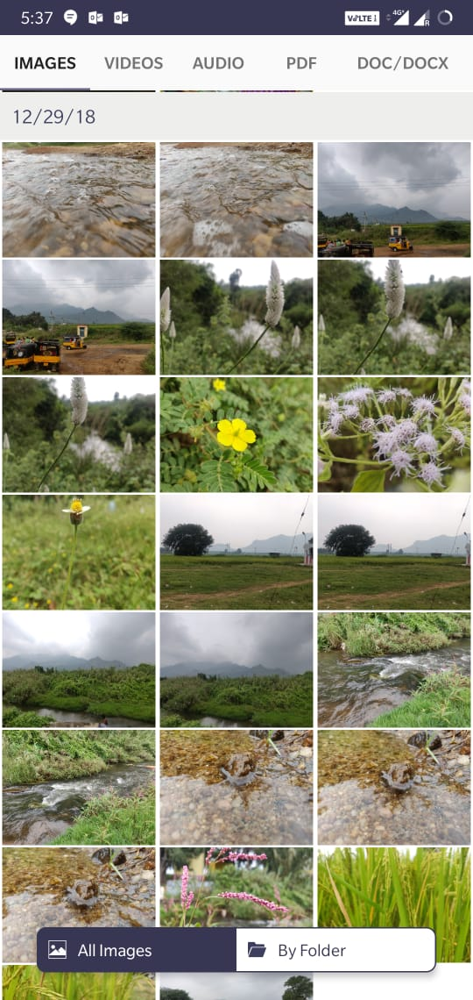
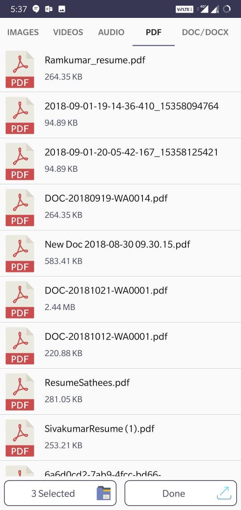
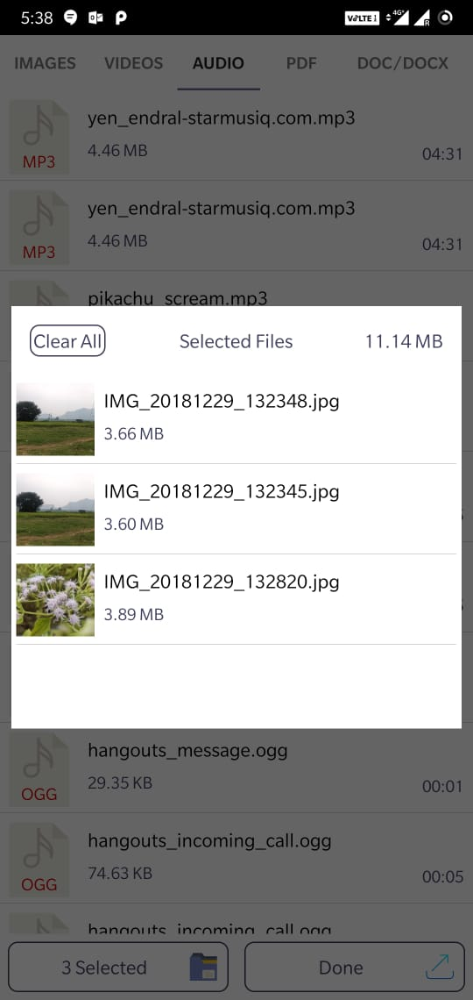

## Description
   The Sample application for attachments selection, with all your internal and external storage media's without any time delay like **SHAREit** app .
   
## ScreenShot
 &nbsp;&nbsp;&nbsp;&nbsp;&nbsp;&nbsp; 


   
   
## Usage
  Import the **AttachmentLibrary** package in your own project and 
  
  
  **In your Application class**
```kotlin
        AttachmentApplication().initiate(this)
```   
 
```kotlin
        AttachmentSelector(this).isImagesNeed(true)
                .isVideoNeed(true).isPDFNeed(true)
                .isAudioNeed(true).isDocNeed(true).start(this)        
``` 

And Implement this interface in your class

```kotlin
    override fun onSelectedAttachments(list: ArrayList<SelectedItemModel>) {
             // the list contain the data's which you selected 
         }   
```

## License
```
Copyright 2019 Ramkumar-27

Licensed under the Apache License, Version 2.0 (the "License");
you may not use this file except in compliance with the License.
You may obtain a copy of the License at

    http://www.apache.org/licenses/LICENSE-2.0

Unless required by applicable law or agreed to in writing, software
distributed under the License is distributed on an "AS IS" BASIS,
WITHOUT WARRANTIES OR CONDITIONS OF ANY KIND, either express or implied.
See the License for the specific language governing permissions and
limitations under the License.
```

      
      
